<div align="center">

  <a href="https://github.com/netease-youdao/QAnything">
    <!-- Please provide path to your logo here -->
    
  </a>

# **Q**uestion and **A**nswer based on **Anything**

<p align="center">
  <a href="./README.md">English</a> |
  <a href="./README_zh.md">简体中文</a>
</p>

</div>

<div align="center">

<a href="https://qanything.ai"></a>
&nbsp;&nbsp;&nbsp;&nbsp;
<a href="https://read.youdao.com#/home"></a>
&nbsp;&nbsp;&nbsp;&nbsp;

<a href="./LICENSE"></a>
&nbsp;&nbsp;&nbsp;&nbsp;
<a href="https://github.com/netease-youdao/QAnything/pulls"></a>
&nbsp;&nbsp;&nbsp;&nbsp;
<a href="https://twitter.com/YDopensource"></a>
&nbsp;&nbsp;&nbsp;&nbsp;

<a href="https://discord.gg/5uNpPsEJz8"></a>
&nbsp;&nbsp;&nbsp;&nbsp;


</div>

<details open="open">
<summary>Table of Contents</summary>

- [What is QAnything](#what-is-qanything)
  - [Key features](#key-features)
  - [Architecture](#architecture)
- [Latest Updates](#-latest-updates)
- [Before You Start](#before-you-start)
- [Getting Started](#getting-started)
  - [Latest Features Table](#latest-features-table)
  - [Version 2.0.0 adds detailed optimizations:](#version-200-adds-detailed-optimizations)
    - [Display of data at each stage:](#display-of-data-at-each-stage)
    - [Problem fixed](#problem-fixed)
  - [Comparison of New and Old Parsing Effects](#comparison-of-new-and-old-parsing-effects)
  - [Installation](#installation)
    - [Prerequisites](#prerequisites)
    - [step1: pull qanything repository](#step1-pull-qanything-repository)
    - [step2: Enter the project root directory and execute the startup command.](#step2-enter-the-project-root-directory-and-execute-the-startup-command)
    - [step3: start to experience](#step3-start-to-experience)
    - [API](#api)
    - [DEBUG](#debug)
    - [Close service](#close-service)
  - [Offline Use](#offline-use)
  - [FAQ](#faq)
  - [Contributing](#contributing)
    - [Thanks to all contributors for their efforts](#thanks-to-all-contributors-for-their-efforts)
    - [Special thanks!](#special-thanks)
  - [Business contact information：](#business-contact-information)
- [Roadmap & Feedback](#-roadmap--feedback)
- [Community & Support](#community--support)
- [License](#license)
- [Acknowledgements](#acknowledgments)

</details>

# 🚀 Important Updates 
<h1><span style="color:red;">Important things should be said three times.</span></h1>

# [2024-05-17:QAnything updated to version 2.0.] 
# [2024-05-17:QAnything updated to version 2.0.]
# [2024-05-17:QAnything updated to version 2.0.]

<h2>

* <span style="color:green">This update brings improvements in various aspects such as usability, resource consumption, search results, question and answer results, parsing results, front-end effects, service architecture, and usage methods.</span>
* <span style="color:green">At the same time, the old Docker version and Python version have been merged into a new unified version, using a single-line command with Docker Compose for one-click startup, ready to use out of the box.</span>

</h2>


## Contributing
We appreciate your interest in contributing to our project. Whether you're fixing a bug, improving an existing feature, or adding something completely new, your contributions are welcome!
### Thanks to all contributors for their efforts
<a href="https://github.com/netease-youdao/QAnything/graphs/contributors">
  
</a>

### Special thanks!
<h2><span style="color:red;">Please note: Our list of contributors is automatically updated, so your contributions may not appear immediately on this list.</span></h2>
<h2><span style="color:red;"Special thanks!：@ikun-moxiaofei</span></h2>
<h2><span style="color:red;">Special thanks!：@Ianarua</span></h2>


## Business contact information：
### 010-82558901


# What is QAnything?
`QAnything`(**Q**uestion and **A**nswer based on **Anything**) is a local knowledge base question-answering system designed to support a wide range of file formats and databases, allowing for offline installation and use.

With `QAnything`, you can simply drop any locally stored file of any format and receive accurate, fast, and reliable answers.

Currently supported formats include: **PDF(pdf)**,**Word(docx)**,**PPT(pptx)**,**XLS(xlsx)**,**Markdown(md)**,**Email(eml)**,**TXT(txt)**,**Image(jpg，jpeg，png)**,**CSV(csv)**,**Web links(html)** and more formats coming soon…


## Key features

- Data security, supports installation and use by unplugging the network cable throughout the process. 
- Supports multiple file types, high parsing success rate, supports cross-language question and answer, freely switches between Chinese and English question and answer, regardless of the language of the file.
- Supports massive data question and answer, two-stage vector sorting, solves the problem of degradation of large-scale data retrieval, the more data, the better the effect, no limit on the number of uploaded files, fast retrieval speed. 
- Hardware friendly, defaults to running in a pure CPU environment, and supports multiple platforms such as Windows, Mac, and Linux, with no dependencies other than Docker. 
- User-friendly, no need for cumbersome configuration, one-click installation and deployment, ready to use, each dependent component (PDF parsing, OCR, embed, rerank, etc.) is completely independent, supports free replacement. 
- Supports a quick start mode similar to Kimi, fileless chat mode, retrieval mode only, custom Bot mode.


## Architecture
<div align="center">

</div>

### Why 2 stage retrieval?
In scenarios with a large volume of knowledge base data, the advantages of a two-stage approach are very clear. If only a first-stage embedding retrieval is used, there will be a problem of retrieval degradation as the data volume increases, as indicated by the green line in the following graph. However, after the second-stage reranking, there can be a stable increase in accuracy, **the more data, the better the performance**.
<div align="center">

</div>

QAnything uses the retrieval component [BCEmbedding](https://github.com/netease-youdao/BCEmbedding), which is distinguished for its bilingual and crosslingual proficiency. BCEmbedding excels in bridging Chinese and English linguistic gaps, which achieves
- **A high performance on <a href="https://github.com/netease-youdao/BCEmbedding/tree/master?tab=readme-ov-file#evaluate-semantic-representation-by-mteb" target="_Self">Semantic Representation Evaluations in MTEB</a>**;
- **A new benchmark in the realm of <a href="https://github.com/netease-youdao/BCEmbedding/tree/master?tab=readme-ov-file#evaluate-rag-by-llamaindex" target="_Self">RAG Evaluations in LlamaIndex</a>**.


### 1st Retrieval（embedding）
| Model | Retrieval | STS | PairClassification | Classification | Reranking | Clustering | Avg |  
|:-------------------------------|:--------:|:--------:|:--------:|:--------:|:--------:|:--------:|:--------:|  
| bge-base-en-v1.5 | 37.14 | 55.06 | 75.45 | 59.73 | 43.05 | 37.74 | 47.20 |  
| bge-base-zh-v1.5 | 47.60 | 63.72 | 77.40 | 63.38 | 54.85 | 32.56 | 53.60 |  
| bge-large-en-v1.5 | 37.15 | 54.09 | 75.00 | 59.24 | 42.68 | 37.32 | 46.82 |  
| bge-large-zh-v1.5 | 47.54 | 64.73 | **79.14** | 64.19 | 55.88 | 33.26 | 54.21 |  
| jina-embeddings-v2-base-en | 31.58 | 54.28 | 74.84 | 58.42 | 41.16 | 34.67 | 44.29 |  
| m3e-base | 46.29 | 63.93 | 71.84 | 64.08 | 52.38 | 37.84 | 53.54 |  
| m3e-large | 34.85 | 59.74 | 67.69 | 60.07 | 48.99 | 31.62 | 46.78 |  
| ***bce-embedding-base_v1*** | **57.60** | **65.73** | 74.96 | **69.00** | **57.29** | **38.95** | ***59.43*** |  

- More evaluation details please check [Embedding Models Evaluation Summary](https://github.com/netease-youdao/BCEmbedding/blob/master/Docs/EvaluationSummary/embedding_eval_summary.md)。

### 2nd Retrieval（rerank）
| Model | Reranking | Avg |  
|:-------------------------------|:--------:|:--------:|  
| bge-reranker-base | 57.78 | 57.78 |  
| bge-reranker-large | 59.69 | 59.69 |  
| ***bce-reranker-base_v1*** | **60.06** | ***60.06*** |  

- More evaluation details please check [Reranker Models Evaluation Summary](https://github.com/netease-youdao/BCEmbedding/blob/master/Docs/EvaluationSummary/reranker_eval_summary.md)

### RAG Evaluations in LlamaIndex（embedding and rerank）


***NOTE:***

- In `WithoutReranker` setting, our `bce-embedding-base_v1` outperforms all the other embedding models.
- With fixing the embedding model, our `bce-reranker-base_v1` achieves the best performance.
- **The combination of `bce-embedding-base_v1` and `bce-reranker-base_v1` is SOTA**.
- If you want to use embedding and rerank separately, please refer to [BCEmbedding](https://github.com/netease-youdao/BCEmbedding)

### LLM

The open source version of QAnything is based on QwenLM and has been fine-tuned on a large number of professional question-answering datasets. It greatly enhances the ability of question-answering.
If you need to use it for commercial purposes, please follow the license of QwenLM. For more details, please refer to: [QwenLM](https://github.com/QwenLM/Qwen)

# 🚀 Latest Updates

- ***2024-08-23***: **Support quick start, front-end configuration parameters, online preview and editing of chunk blocks, greatly optimize project architecture and startup mode, greatly optimize parsing and retrieval effects.** - See More👉 [v2.0.0](https://github.com/netease-youdao/QAnything/releases/tag/v2.0.0) 
- ***2024-05-20***: **Support other large model services compatible with OpenAI API, and provide an optimized powerful PDF parser.** - See More👉 [v1.4.1](https://github.com/netease-youdao/QAnything/releases/tag/v1.4.1)
- ***2024-04-26***: **Support web search, FAQ, custom bot, file traceability preview etc.** - See More👉 [v1.4.0](https://github.com/netease-youdao/QAnything/releases/tag/v1.4.0-python)
- ***2024-04-03***: **Support installation in a pure Python environment.Support hybrid search.** - See More👉 [v1.3.0](https://github.com/netease-youdao/QAnything/releases/tag/v1.3.0)
- ***2024-01-29***: **Support for custom large models, including OpenAI API and other open-source large models, with a minimum GPU requirement of GTX 1050Ti, greatly improving deployment, debugging, and user experience.** - See More👉 [v1.2.0](https://github.com/netease-youdao/QAnything/releases/tag/v1.2.0)
- ***2024-01-23***: **Enable rerank by default and fix various issues when starting on Windows.** - See More👉 [v1.1.1](https://github.com/netease-youdao/QAnything/releases/tag/v1.1.1)
- ***2024-01-18***: **Support one-click startup, support Windows deployment, improve PDF, XLSX, HTML parsing efficiency.** - See More👉 [v1.1.0](https://github.com/netease-youdao/QAnything/releases/tag/v1.1.0)

# Before You Start
**Star us on GitHub, and be instantly notified for new release!**

* [🏄 Try QAnything Online](https://qanything.ai)
* [📚 Try read.youdao.com | 有道速读](https://read.youdao.com)
* [🛠️ Only use our BCEmbedding(embedding & rerank)](https://github.com/netease-youdao/BCEmbedding)
* [📖 FAQ](FAQ_zh.md)
* [👂️Let me hear your voice](https://qanything.canny.io/feature-requests)


# Getting Started
## Latest Features Table


| features                                                             | python （v1.4.2） | docker （v1.2.2） | QAnything v2.0.0 | Explanation                                                                                                                                                                                                     |
|----------------------------------------------------------------------|-----------------|-----------------|------------------|-----------------------------------------------------------------------------------------------------------------------------------------------------------------------------------------------------------------|
| Detailed installation document                                       | ✅               | ✅               | ✅                |                                                                                                                                                                                                                 |
| Support API                                                          | ✅               | ✅               | ✅                |                                                                                                                                                                                                                 |
| Support production environment                                       | ❌               | ✅               | ✅                |                                                                                                                                                                                                                 |
| Support offline use                                                  | ❌               | ✅               | ✅                |                                                                                                                                                                                                                 |
| Support multiple concurrency                                         | ❌               | ✅               | ✅                |                                                                                                                                                                                                                 |
| Support multi-card inference                                         | ❌               | ✅               | ❌                | Version 2.0.0 no longer provides default local LLM. All access is through the openai interface, and users can deploy local LLM through tools such as ollama.                                                    |
| Support Mac (M series chips)                                         | ✅               | ❌               | ✅                |                                                                                                                                                                                                                 |
| Support Linux                                                        | ✅               | ✅               | ✅                | The old version of Python defaults to using onnxruntime-gpu for cuda12 on Linux, and automatically switches to onnxruntime when glibc<2.28.                                                                     |
| Support windows                                                      | ❌               | ❌               | ✅                | Both old versions of Python and Docker require WSL environment. Version 2.0.0 can be started directly in a non-WSL environment.                                                                                 |
| Support CPU only                                                     | ✅               | ❌               | ✅                | Version 2.0.0 Mac, Linux, Win unified no longer use GPU, completely migrated to CPU.                                                                                                                            |
| Support hybrid search (BM25+embedding)                               | ❌               | ✅               | ✅                |                                                                                                                                                                                                                 |
| Support web search (need VPN)                                        | ✅               | ❌               | ✅                |                                                                                                                                                                                                                 |
| Support FAQ                                                          | ✅               | ❌               | ✅                |                                                                                                                                                                                                                 |
| Support BOT                                                          | ✅               | ❌               | ✅                |                                                                                                                                                                                                                 |
| Support Traceability                                                 | ✅               | ❌               | ✅                |                                                                                                                                                                                                                 |
| Support Log retrieval                                                | ✅               | ❌               | ✅                |                                                                                                                                                                                                                 |
| Support audio file                                                   | ✅               | ❌               | ❌                | Relying on whisper, slow speed and high resource consumption, temporarily removed.                                                                                                                              |
| Support OpenCloudOS                                                  | ✅               | ❌               | ✅                |                                                                                                                                                                                                                 |
| Support interfaces compatible with Openaiapi (including ollama)      | ✅               | ✅               | ✅                | Old versions of Python and Docker require manual modification of parameters such as api_key, base_url, model, etc. In version 2.0.0, these are all changed to be automatically saved in the front end settings. |
| PDF parsing performance improvement (including tables)               | ✅               | ❌               | ✅                | Version 1.4.2 requires manual settings, version 2.0.0 does not require manual settings, and both the PDF parsing effect and performance have been improved.                                                     |
| User-defined configuration (Experimental: Improve speed)             | ✅               | ❌               | ✅                | v1.4.2 needs to be set manually, v2.0.0 uses the best configuration by default.                                                                                                                                 |
| Improvement in parsing performance of other file types               | ❌               | ❌               | ✅                | Version 2.0.0 improves the parsing effect of URLs, Markdown, XLSX, DOCX, etc.                                                                                                                                   |
| Support independent service invocation                               | ❌               | ❌               | ✅                | Version 2.0.0 independent dependent services, including embed, rerank, ocr, pdf parsing services, can be called independently (http)                                                                            |
| Support quick start mode                                             | ❌               | ❌               | ✅                | Quick Start: No need to create a knowledge base, support for file upload and instant questioning, support for fileless Q&A.                                                                                     |
| Support only retrieval mode                                          | ❌               | ❌               | ✅                | Only return search results, do not call the large model for question answering.                                                                                                                                 |
| Support parsing result chunks content visualization, manual editing. | ❌               | ❌               | ✅                | Version 2.0.0 supports manually editing the contents of chunks, which take effect in real time.                                                                                                                 |
| PDF parsing supports images, supports answering with images.         | ❌               | ❌               | ✅                |                                                                                                                                                                                                                 |


## Version 2.0.0 adds detailed optimizations:

* Support front-end configuration API_BASE, API_KEY, text chunk size, output token quantity, context message quantity, etc.
* Optimize the instruction compliance of Bot role settings, each Bot can configure model parameters separately.
* Support creating multiple dialogue windows and saving multiple sets of historical Q&A records at the same time.
* Support saving question and answer records as images
* Optimize the logic of uploading files, parse files and question-and-answer requests independently, uploading files will no longer affect question-and-answer.
* Optimize image size, the compressed size of the old version image is 18.94GB -> the compressed size of the new version image is 4.88GB, reduced to 1/4 of the original size, providing a complete Dockerfile.
* Search optimization, chunks add fragment fusion and sorting, aggregate single document or double document.
* Both the retrieval stage and the question-answering stage embed metadata information to improve the retrieval and question-answering effectiveness. 

### Display of data at each stage:
* Display the upload progress of all files in the knowledge base.
* Display the progress of uploading a single file in the knowledge base, and the time consumed in each stage of the upload.
* Question and answer information statistics, including time consumption at each stage of question and answer, token consumption, model information, etc.
* User information statistics, including total number of uploaded files, total time consumed, question and answer history records, etc. (coming soon)

### Problem fixed
* The xlsx file format supports parsing multiple sheets.
* Optimize the problem of missing recognition of PDF tables.
* Fix some parsing errors in DOCX files.
* Optimize FAQ matching logic.
* Support for non-UTF-8 encoded txt files. 

## Comparison of New and Old Parsing Effects
* First, with regard to the parsing of large tables in documents, especially tables that span multiple pages, version 2.0 has made significant improvements. The new version's parsing logic can analyze the structure of the table, including the layout of rows and columns, and can automatically identify the table headers, placing them at the top of each table segment that is split. This improvement prevents interruptions in meaning caused by logical segmentation when parsing long tables.

| Original image | Old version parsing effect | New version parsing effect |
|:----:|:--------------------------------------------:|:---------------------------------------------------------------------------------------------:|
|  | 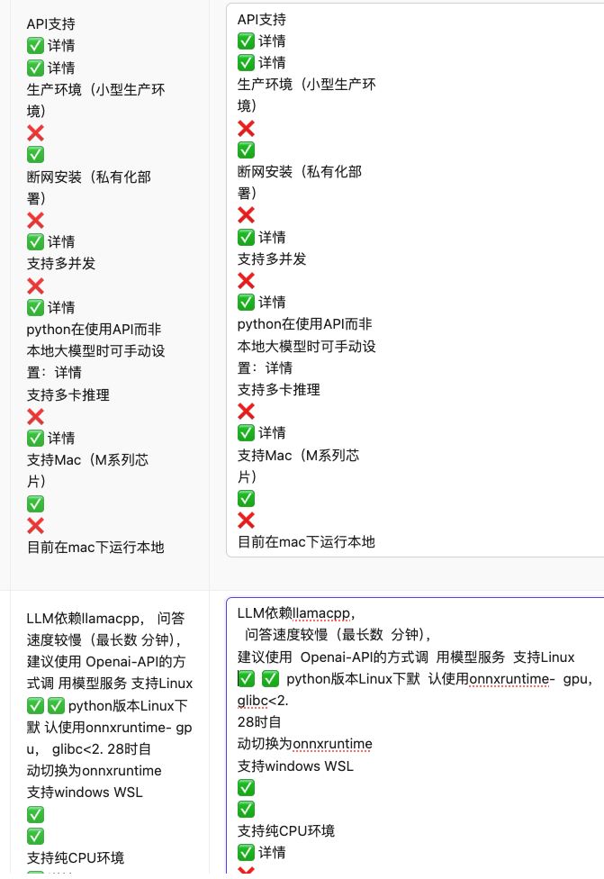 |  |

* In addition, version 2.0 has also been optimized for handling text columnation and cross-page layout. It can recognize double-column or multi-column layouts of text and correctly divide text blocks in accordance with human reading habits. At the same time, this version can also save images in documents to ensure the integrity of content is not lost during file parsing. As shown in the figure below, the correct arrangement should be to group the text arranged in sequence as 1, 2, 3 into a large paragraph and then segment it, rather than segmenting 1, 2, 3 separately.
  * In version 1.4 parsing results, the cross-page text "higher" was chunked into the next text block, which is detrimental to large model semantic understanding. In version 2.0 parsing results, it is correctly divided, and images interspersed in text paragraphs are also parsed into corresponding chunk statements. Non-main text such as "Figure 1 Identification and Authorization and Their Support Relationship 37" and "Cover Story Cover Feature" were successfully filtered out.

| Original image | Old version parsing effect | New version parsing effect |
|:----:|:--------------------------------------------:|:---------------------------------------------------------------------------------------------:|
| 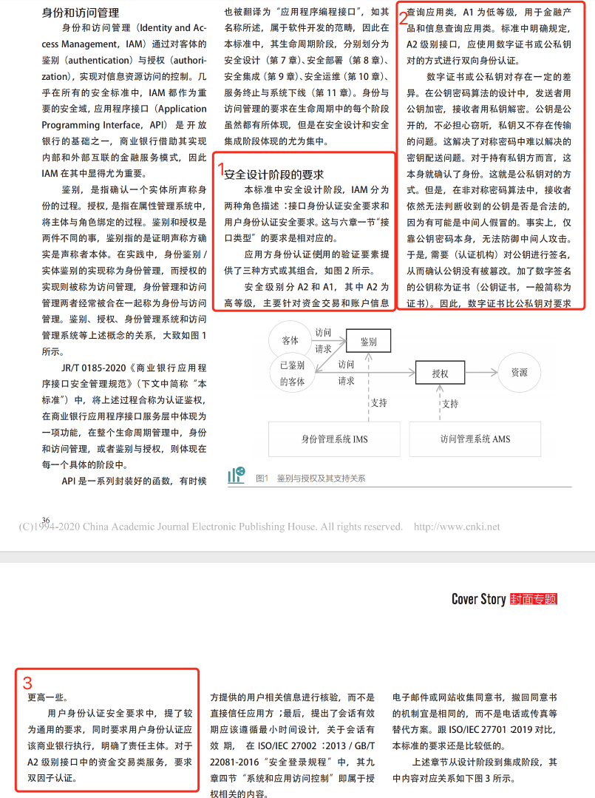 | 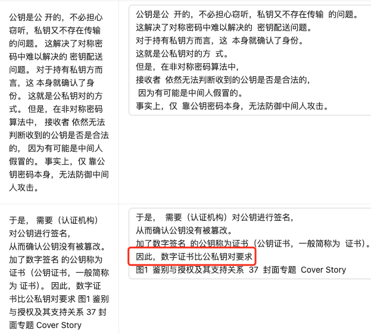<br/> | 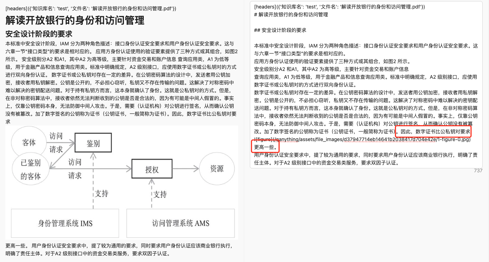 |

* Version 2.0 has also made corresponding optimizations for parsing tables interspersed between text columns or text blocks. The parsing of the original version could not recognize tables and would only parse them in the format of text paragraphs. This not only destroys the logical structure of the tables but also adds a section of messy and useless text for large models, which would affect the accuracy of large model responses. Version 2.0 can recognize and parse these tables embedded in the text, thereby improving the quality of parsing and the accuracy of responses from large models.
  * In version 1.4 parsing results, tables interspersed in text blocks are parsed as normal text blocks. In version 2.0, this type of table can be parsed "elegantly", which not only improves the quality of parsing but also increases the accuracy of large model answers.
  * In addition, in version 2.0, when processing text under specific subheadings, priority is given to ensuring that these texts are segmented into the same chunk block to maintain logical coherence. When the text is too long and needs to be split, the parsing logic of version 2.0 will repeat the same subheading before each split text block to indicate ownership. For example, in the example, the same subheading "European Conference: Legal Status of Robots" was added to all three text blocks (due to the length of the text, this title was not displayed in the original file screenshot). This processing method effectively avoids the problem of incoherent semantic logic in split text blocks caused by excessively long text. 

| Original image | Old version parsing effect | New version parsing effect |
|:----:|:--------------------------------------------:|:---------------------------------------------------------------------------------------------:|
| 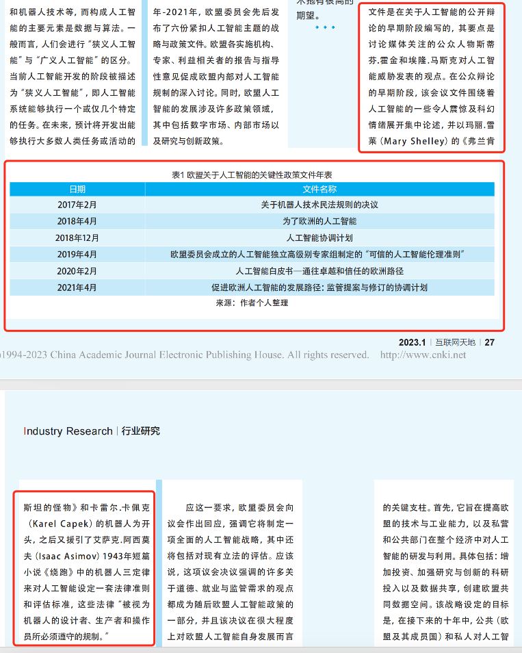 | 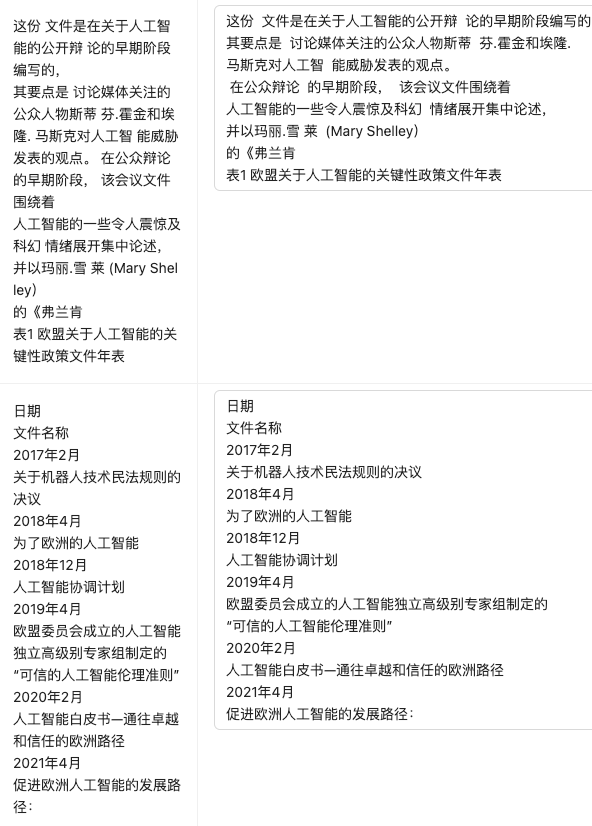 | 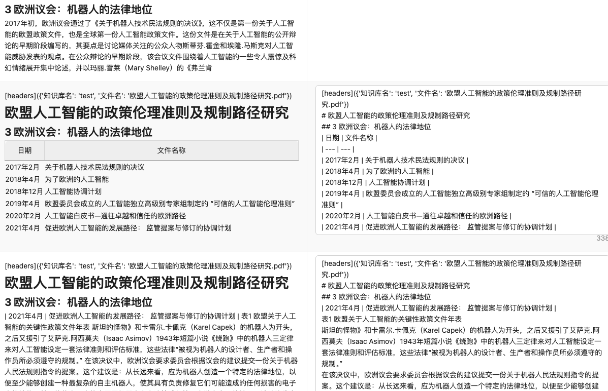 |

* For Excel (.xlsx) documents with complex formatting, version 2.0 has undergone a series of optimization measures to accurately identify and process row and column data, including optimized handling of merged cells and text spanning across rows or columns. Specific examples can be seen below.
  * In version 1.4, there may be some limitations when parsing Excel documents, especially for documents with special structures or formats. The parsing results may not be satisfactory, mainly recognizing only the plain text part. This may lead to information loss or format disorder when dealing with complex data and formats. In contrast, version 2.0 has significantly improved parsing capabilities, able to better handle various complex formats of Excel documents. Although it may not be perfect yet, it can already solve the vast majority of complex situations. 

| Original image | Old version parsing effect | New version parsing effect |
|:----:|:--------------------------------------------:|:---------------------------------------------------------------------------------------------:|
| 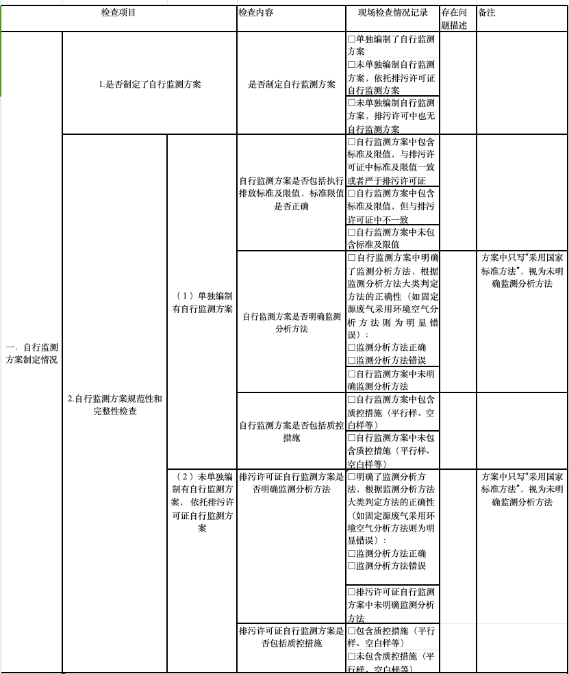 |  | 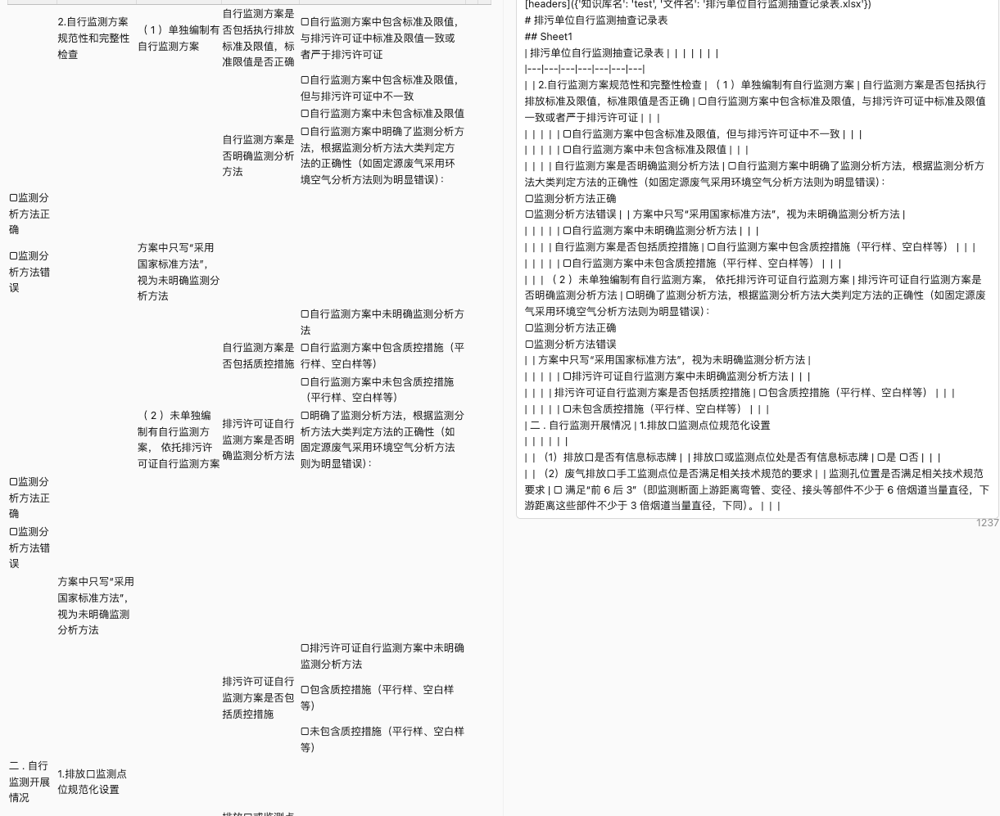 |

* Similarly, for simple formatted xlsx documents, version 2.0 of the parser has been optimized.

| Original image | Old version parsing effect | New version parsing effect |
|:----:|:--------------------------------------------:|:---------------------------------------------------------------------------------------------:|
|  |  | 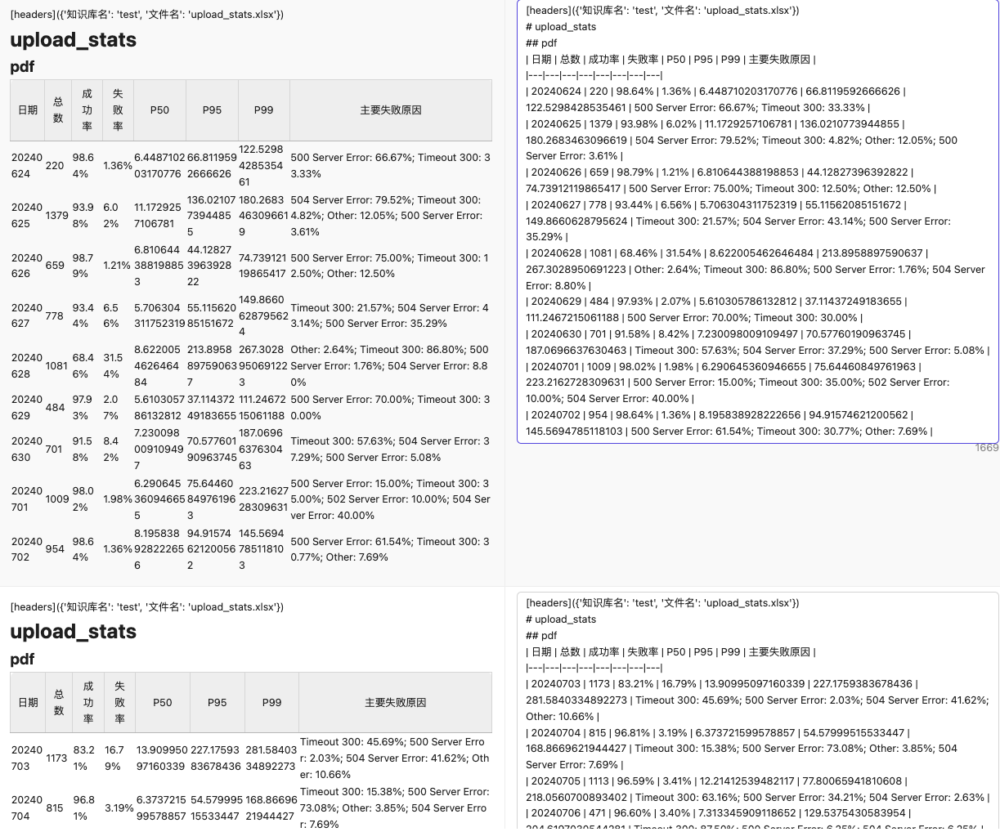 |

* In the latest version, we have also made significant improvements to the URL parsing function. Taking the following page as an example, the old version may miss a large amount of page information during the parsing process and cannot effectively handle more complex page elements such as tables and lists. However, the new version has been optimized for these issues and can parse these contents more accurately.

| Original image | Old version parsing effect | New version parsing effect |
|:----:|:--------------------------------------------:|:---------------------------------------------------------------------------------------------:|
|  | <br/> |  |

* In addition, for the vast majority of files, version 2.0 has also made corresponding optimizations, including but not limited to the following points.
  * Improved the cutting logic of chunk blocks, avoiding semantic blocks being too short or logic interruption due to blank lines or paragraphs in the document, ensuring the coherence and integrity of text blocks. 
  * The new version can more accurately identify the subheadings in the document, and locate and organize the corresponding text blocks based on these subheadings, which helps optimize the parsing effect, making the parsing structure clearer and the information hierarchy more distinct.
  * The comparison of the analysis results is as follows: In version 1.4, the parsing logic divides the document into 10 chunks, while in version 2.0, after parsing, there are only 4 chunks. The more reasonable and fewer chunk blocks greatly improve the coherence and integrity of the content, helping to reduce semantic breaks or logical confusion caused by improper segmentation, thereby improving the overall parsing and model answering effects. 

| Original image | Old version parsing effect | New version parsing effect |
|:----:|:--------------------------------------------:|:---------------------------------------------------------------------------------------------:|
| 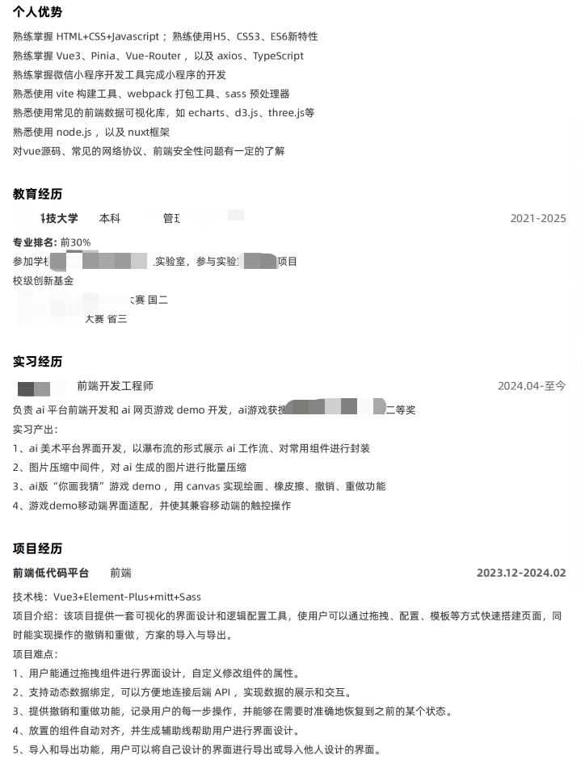 | 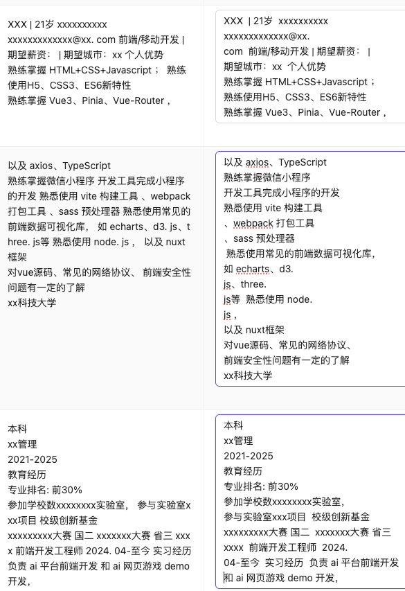 |  |

### In summary, version 2.0 parsing has optimized many aspects compared to version 1.4 parsing, including but not limited to
1. By using more reasonable chunk lengths, the semantic and logical losses caused by paragraphs being too small or incomplete are reduced. 
2. Improved recognition ability for columned text, able to intelligently determine reading order, even correctly handling paragraphs that span across pages. 
3. The new version can recognize and save images and tables within text paragraphs, ensuring that no important text information is missed. 
4. Optimized table parsing, including parsing and storage of long tables exceeding chunk limits and complex structured xlsx files. 
5. Based on the identified subheadings in the document, locate and organize corresponding text blocks to make the parsing structure clearer and the information hierarchy more distinct. 
6. Optimized parsing results for webpage URLs, converted to .md format. 
7. Support for more encoding formats of txt files and docx files.

## Installation
### Prerequisites
| **System** | **Required item**       | **Minimum Requirement** | **Note**                                                                               |
|------------|-------------------------|-------------------------|----------------------------------------------------------------------------------------|
|            | RAM Memory              | >= 20GB                 |                                                                                        |
| Linux/Mac  | Docker version          | >= 20.10.5              | [Docker install](https://docs.docker.com/engine/install/)                              |
| Linux/Mac  | docker compose  version | >= 2.23.3               | [docker compose install](https://docs.docker.com/compose/install/)                     |
| Windows    | Docker Desktop          | >= 4.26.1（131620）       | [Docker Desktop for Windows](https://docs.docker.com/desktop/install/windows-install/) |

### step1: pull qanything repository
```shell
git clone https://github.com/netease-youdao/QAnything.git
```
### step2: Enter the project root directory and execute the startup command.
* Execute the docker compose start command

```shell
cd QAnything
# Start on Linux
docker compose -f docker-compose-linux.yaml up
# Start on Mac
docker compose -f docker-compose-mac.yaml up
# Start on Windows
docker compose -f docker-compose-win.yaml up
```

(Note) If the startup fails, you can try changing `docker compose` to `docker-compose`.

### step3: start to experience
#### Front end
After successful installation, you can experience the application by entering the following addresses in your web browser.

- Front end address: http://localhost:8777/qanything/

### API
If you want to visit API, please refer to the following address:
- API address: http://localhost:8777/qanything/
- For detailed API documentation, please refer to [QAnything API documentation](docs/API.md)

### DEBUG
If you want to view the relevant logs, please check the log files in the `QAnything/logs/debug_logs` directory.
- **debug.log**
  - User request processing log
- **sanic_api.log**
  - Backend service running log
- **llm_embed_rerank_tritonserver.log**(Single card deployment)
  - LLM embedding and rerank tritonserver service startup log
- **llm_tritonserver.log**(Multi-card deployment)
  - LLM tritonserver service startup log
- **embed_rerank_tritonserver.log**(Multi-card deployment or use of the OpenAI interface.)
  - Embedding and rerank tritonserver service startup log
- rerank_server.log
  - Rerank service running log
- ocr_server.log
  - OCR service running log
- npm_server.log
  - Front-end service running log 
- llm_server_entrypoint.log
  - LLM intermediate server running log
- fastchat_logs/*.log
  - FastChat service running log

### Close service
```shell
# Front desk service startup mode like:
docker compose -f docker-compose-xxx.yaml up  # To close the service, please press Ctrl+C.
# Backend service startup mode like: 
docker compose -f docker-compose-xxx.yaml up -d # To close the service, please execute the following command.
docker compose -f docker-compose-xxx.yaml down
```

## Offline Use
If you want to use QAnything offline, you need to deploy the local large model (recommended to use ollama) on the offline machine in advance, and then you can start the service using the following command.
### Install offline for windows 
```shell
# Download the docker image on a networked machine
docker pull quay.io/coreos/etcd:v3.5.5
docker pull minio/minio:RELEASE.2023-03-20T20-16-18Z
docker pull milvusdb/milvus:v2.4.8
docker pull mysql:8.4
docker pull xixihahaliu01/qanything-win:v1.5.1  # From [https://github.com/netease-youdao/QAnything/blob/master/docker-compose-windows.yaml#L103] Get the latest version number.

# pack image
docker save quay.io/coreos/etcd:v3.5.5 minio/minio:RELEASE.2023-03-20T20-16-18Z milvusdb/milvus:v2.4.8 mysql:8.4 xixihahaliu01/qanything-win:v1.5.1 -o qanything_offline.tar

# download QAnything code
wget https://github.com/netease-youdao/QAnything/archive/refs/heads/master.zip

# Copy the image qanything_offline.tar and the code qany-master.zip to the offline machine 
cp QAnything-master.zip qanything_offline.tar /path/to/your/offline/machine

# Load image on offline machine 
docker load -i qanything_offline.tar

# Unzip the code and run it
unzip QAnything-master.zip
cd QAnything-master
docker compose -f docker-compose-win.yaml up
``` 
Similarly for other systems, just replace the corresponding image of the system, such as replacing mac with docker-compose-mac.yaml, and linux with docker-compose-linux.yaml.


## FAQ
[FAQ](FAQ_zh.md)


## Contributing
We appreciate your interest in contributing to our project. Whether you're fixing a bug, improving an existing feature, or adding something completely new, your contributions are welcome!
### Thanks to all contributors for their efforts
<a href="https://github.com/netease-youdao/QAnything/graphs/contributors">
  
</a>


# 🛣️ Roadmap & Feedback
🔎 To learn about QAnything's future plans and progress, please see here: [QAnything Roadmap](https://qanything.canny.io/)

🤬To provide feedback to QAnything, please see here: [QAnything Feedbak](https://qanything.canny.io/feature-requests)

# Community & Support

## Discord <a href="https://discord.gg/5uNpPsEJz8"></a>
Welcome to the QAnything [Discord](https://discord.gg/5uNpPsEJz8) community


## WeChat

Welcome to follow QAnything WeChat Official Account to get the latest information.


Welcome to scan the code to join the QAnything discussion group.


## Email
If you need to contact our team privately, please reach out to us via the following email:

qanything@rd.netease.com

## GitHub issues & discussions
Reach out to the maintainer at one of the following places:

- [Github issues](https://github.com/netease-youdao/QAnything/issues)
- [Github discussions](https://github.com/netease-youdao/QAnything/discussions)
- Contact options listed on [this GitHub profile](https://github.com/netease-youdao)

<a href="https://github.com/netease-youdao/QAnything/discussions">
  <!-- Please provide path to your logo here -->
  
</a>


# Star History

[](https://star-history.com/#netease-youdao/QAnything&netease-youdao/BCEmbedding&Date)


# License

`QAnything` is licensed under [AGPL-3.0 License](./LICENSE)

# Acknowledgments
`QAnything` adopts dependencies from the following:
- Thanks to our [BCEmbedding](https://github.com/netease-youdao/BCEmbedding) for the excellent embedding and rerank model. 
- Thanks to [Qwen](https://github.com/QwenLM/Qwen) for strong base language models.
- Thanks to [Triton Inference Server](https://github.com/triton-inference-server/server) for providing great open source inference serving.
- Thanks to [FastChat](https://github.com/lm-sys/FastChat) for providing a fully OpenAI-compatible API server.
- Thanks to [FasterTransformer](https://github.com/NVIDIA/FasterTransformer) and [vllm](https://github.com/vllm-project/vllm) for highly optimized LLM inference backend.
- Thanks to [Langchain](https://github.com/langchain-ai/langchain) for the wonderful llm application framework. 
- Thanks to [Langchain-Chatchat](https://github.com/chatchat-space/Langchain-Chatchat) for the inspiration provided on local knowledge base Q&A.
- Thanks to [Milvus](https://github.com/milvus-io/milvus) for the excellent semantic search library.
- Thanks to [PaddleOCR](https://github.com/PaddlePaddle/PaddleOCR) for its ease-to-use OCR library.
- Thanks to [Sanic](https://github.com/sanic-org/sanic) for the powerful web service framework.
- Thanks to [RAGFlow](https://github.com/infiniflow/ragflow) for providing some ideas for document parsing.